# aside-remote

Use [Aside](https://aside.dev) (the agent browser) **from your phone, or any browser** —
a small local bridge that turns your desktop Aside into a chat web app.

```
phone / laptop ──HTTPS/WSS──> (your tunnel + auth) ──> 127.0.0.1:8799  aside-remote
                                                          ├─ aside mcp    persistent process = browser REPL
                                                          ├─ aside exec   PTY = agent runs
                                                          ├─ messages.jsonl tail = live streaming
                                                          └─ aside session list = authenticated status
```

What you get:

- **Chat UI** for your Aside agent — virtualized conversations and searchable history, live response
  fragments with linked citations and folded tool activity, image attachments (camera on phones),
  markdown/code rendering, a mobile-first monochrome interface with light/dark mode,
  Wanted Sans, compact D2Coding source blocks, outline icons, and Motion sheet/drawer transitions.
  The composer keeps multiline drafts and shows one send/stop control. Change the theme
  in Settings → Appearance; the choice persists after reload.
- **Interactive visuals** — HTML visual blocks render inside the conversation.
  Switch between the working preview and its source without leaving the chat.
- **Model selection** — choose the provider, model, and reasoning effort from the composer.
- **Follow-up messages** — send during a response to queue the next turn. Queued
  messages appear as conversation bubbles; their menu can edit, steer the current
  response, or cancel the message. Stopping a response pauses its queue until resumed.
- **Tab browser** — see all open Chrome tabs with live thumbnails, ask the agent to
  work on any tab, and open a preview sheet that updates automatically and recovers
  after connection failures. A draggable picture-in-picture preview follows the current
  session, remembers its position, and can be minimized or expanded. Open the page in
  your own browser from either preview. Tab lists and visible thumbnails update automatically.
- **Conversation controls** — pin, rename, share, or copy the conversation link and
  session ID. Pinned conversations appear first; other conversations sort by recent activity.
- **Conversation deletion** — confirm before deleting a conversation and its local
  session files. Running conversations must be stopped in Aside before deletion.
- **Conversation routing** — `/c/<session>` deep links and automatic restoration of
  the last conversation. Notification links load the matching conversation within the chat.
- **Native Web Push notifications** when a response finishes while this device is
  away from the app, including iPhone Home Screen apps. Alerts show the completed
  answer preview; long answers are truncated to fit the push payload. Enable them in Settings →
  Notifications. Optional ntfy notifications remain available.

The UI language is English. Conversation content keeps its original language.

On iOS 16.4 or later, open the HTTPS site in Safari, add it to your Home Screen,
then open that app and choose Settings → Notifications → Enable notifications.
Allow the iOS permission prompt once. Alerts open the matching conversation and
work while the app is in the background or closed. Keep the Mac bridge running
and online. Focused devices do not receive completion alerts, and stopping a
response in Aside Remote does not send one. Notification keys and subscriptions are
created automatically in `~/.aside-remote/web-push` with owner-only file access;
no Apple developer account or manual push credentials are needed.

The app follows a ChatGPT iOS-inspired conversation layout with an anchored composer.
[DESIGN.md](DESIGN.md) documents the reference, tokens, states, and responsive rules.

## Screenshots

Actual app captures from a public demo conversation, using a phone-sized browser and
an iPhone simulator. The demo opens a public page, runs browser tools, renders an
interactive HTML diagram, and accepts a queued message through **Steer instead**.
Click any image to view it at full size.

<table>
  <tr>
    <th>Code and conversation</th>
    <th>Interactive HTML visual</th>
    <th>Visual source</th>
  </tr>
  <tr>
    <td><a href="docs/screenshots/code-response.png">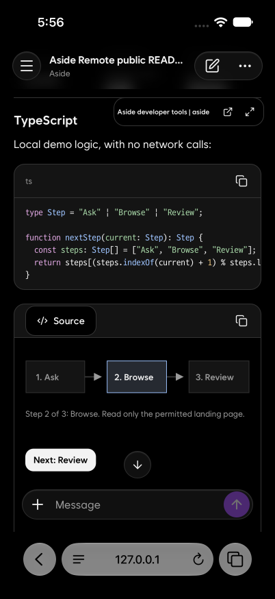</a></td>
    <td><a href="docs/screenshots/visual-preview.png">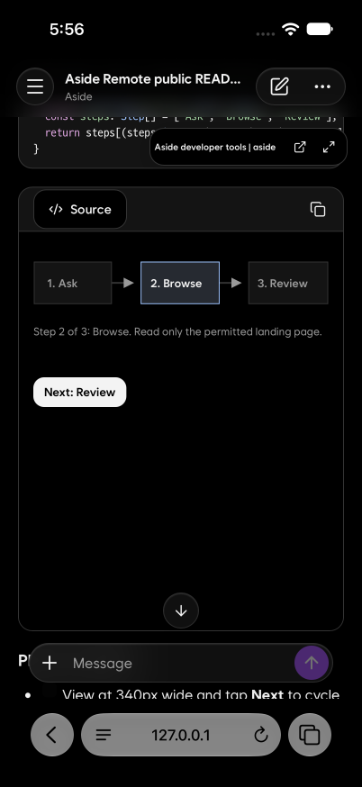</a></td>
    <td><a href="docs/screenshots/visual-source.png">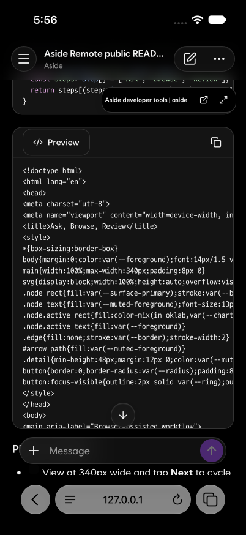</a></td>
  </tr>
  <tr>
    <th>Tool activity</th>
    <th>Queue and steering</th>
    <th>Edit a queued message</th>
  </tr>
  <tr>
    <td><a href="docs/screenshots/tool-activity.png">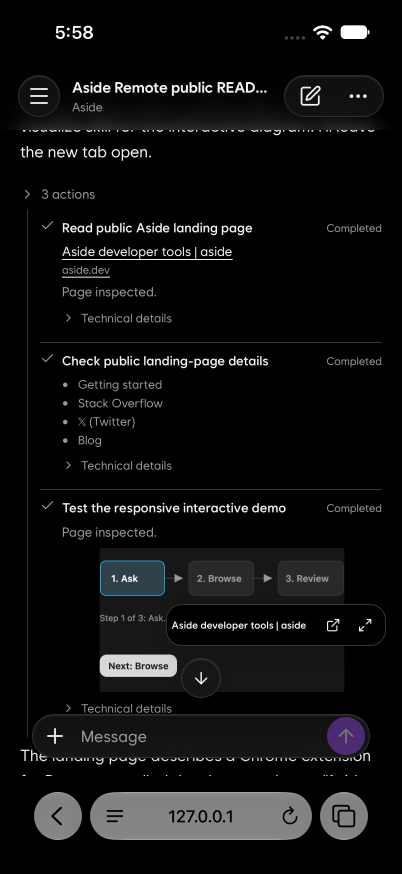</a></td>
    <td><a href="docs/screenshots/queue-steering.jpg">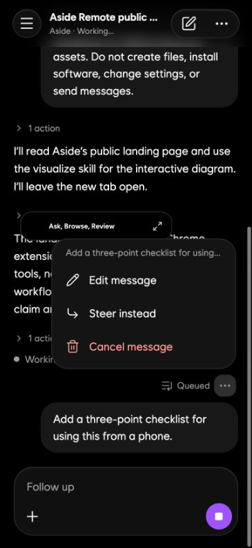</a></td>
    <td><a href="docs/screenshots/queue-edit.jpg">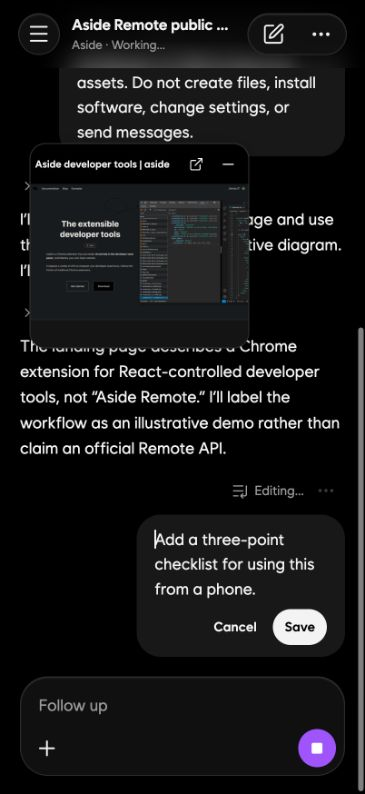</a></td>
  </tr>
  <tr>
    <th>Conversation drawer</th>
    <th>Conversation menu</th>
    <th>Model picker</th>
  </tr>
  <tr>
    <td><a href="docs/screenshots/conversation-drawer.png">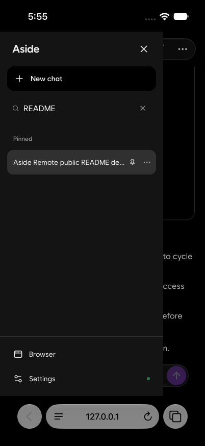</a></td>
    <td><a href="docs/screenshots/conversation-menu.png">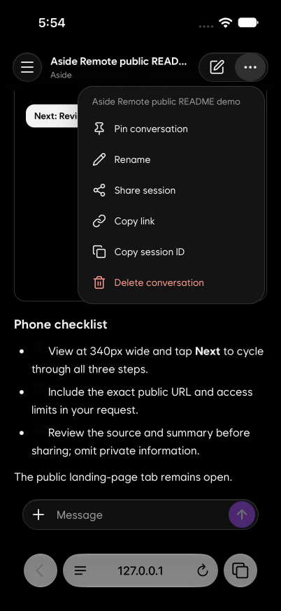</a></td>
    <td><a href="docs/screenshots/model-picker.png">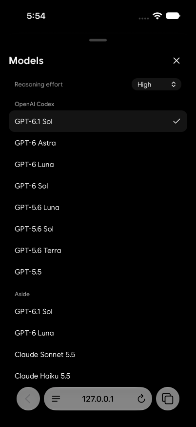</a></td>
  </tr>
  <tr>
    <th>Browser picture-in-picture</th>
    <th>Browser sheet</th>
    <th>Connection and notifications</th>
  </tr>
  <tr>
    <td><a href="docs/screenshots/browser-pip.png">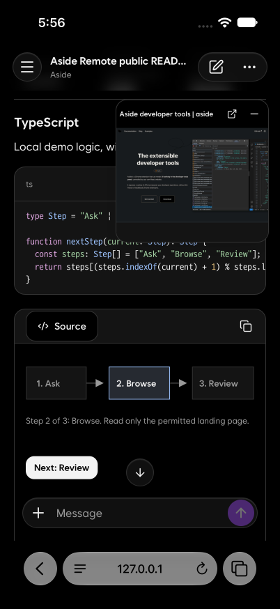</a></td>
    <td><a href="docs/screenshots/browser-sheet.png">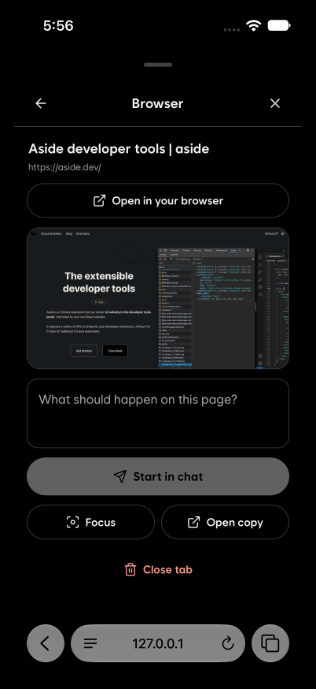</a></td>
    <td><a href="docs/screenshots/settings.png">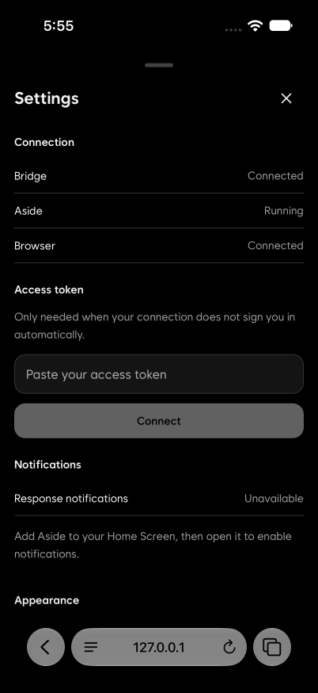</a></td>
  </tr>
</table>

## Requirements

- macOS with the [Aside](https://aside.dev) app installed and signed in
  (the bridge drives Aside's own CLI — it has no AI keys of its own)
- Python ≥ 3.10
- Node.js 22.22.2+ (22.x), 24.15.0+ (24.x), or 26+ and npm for building the frontend

## Quick start

```bash
git clone <this repo> && cd aside-remote
pip install -r requirements.txt
npm ci
npm run build
python3 scripts/setup.py        # guided; --yes for defaults
python3 server.py               # or let the wizard install a launchd service
```

Open http://127.0.0.1:8799 — on localhost the token is picked up automatically.

## Remote access (phone)

The bridge binds to loopback and **must never be exposed raw**: it can run agents
and execute JavaScript in your browser. Put a real auth layer in front. Two options
that work well:

**Tailscale / VPN** — simplest. `ASIDE_REMOTE_HOST=<tailscale-ip>` (or keep loopback
and use `tailscale serve`), open `http://<mac>:8799`, paste the bearer token from
`~/.aside-remote/token` once in Settings.

**Cloudflare Tunnel + Access** — what this repo is built around. Sketch:

1. `cloudflared` tunnel: your domain → `http://127.0.0.1:8799`
2. Cloudflare Zero Trust → Access application for that hostname
   - allow your login email (browser use)
   - add a *service token* if you want a native app shell later
3. Tell the bridge how to verify Access JWTs (wizard step 3, or by hand):

```bash
# ~/.aside-remote/env
ASIDE_REMOTE_ACCESS_TEAM=yourteam.cloudflareaccess.com
ASIDE_REMOTE_ACCESS_AUD=<Access app AUD tag>
ASIDE_REMOTE_ACCESS_EMAILS=you@example.com
```

With that set, a browser that passed the Access login gets the bearer token
automatically (`/api/web-token` verifies the `cf-access-jwt-assertion` signature
against your team's public keys — it does not trust bare headers). No token pasting.

## Manual setup (no wizard)

Everything lives in env vars / an env file — see [`.env.example`](.env.example)
for every key. Minimum viable:

```bash
python3 -c "import secrets;print(secrets.token_urlsafe(32))" > ~/.aside-remote/token
chmod 600 ~/.aside-remote/token
python3 server.py
```

launchd service: render `deploy/com.aside-remote.plist.template`
(`__PYTHON__`, `__REPO__`, `__HOME__`) into `~/Library/LaunchAgents/` and
`launchctl bootstrap gui/$UID <plist>`, or just run `python3 scripts/setup.py --install-service`.

## Security model

```
layer 1   your front door (CF Access / Tailscale / VPN)  — identity
layer 2   bearer token on every API call & WebSocket     — second factor
          (HttpOnly cookie for /WS; never in URLs)
```

- `/api/repl` executes JavaScript in your logged-in browser. Treat the bridge
  like SSH access to your machine.
- File serving is jailed to Aside's session/upload directories (path-escape checked).
- Uploads are sniffed by magic bytes, stored under content hashes.

## How it works — and why it may break

Aside ships no public API. This bridge stands on **reverse-engineered internals**,
verified by measurement (Aside ~1.26.x, 2026-08). The interesting constraints:

```
daemon :21420          write paths are all 401 (install-key challenge signing, key in
                       Keychain → not reimplemented). A few read paths are public:
                       /health /session/recents — but recents is a volatile window,
                       so session listing reads ~/.aside/u/0/sessions from disk instead.
aside exec             prints nothing on a pipe → PTY required. Even then only the
                       final answer; intermediate steps exist only in messages.jsonl.
                       Doesn't print its session id → detected via new-directory diff.
                       After a daemon restart, exec-created sessions can't be continued
                       ("Session not found") — the UI surfaces this.
aside mcp              exposes exactly one tool (repl), but with full browser power.
                       Holding the process keeps REPL scope alive 30 min (measured).
repl sandbox           fs is jailed to "Project and session roots" + the Aside user
                       root (~/.aside/u/0) — that's where uploads go so the agent
                       can actually read them. require()/child_process are blocked.
chrome.* in repl       tabs.query allowed (that's where lastAccessed for tab ordering
                       comes from); tabs.update/reload blocked.
```

An Aside update can invalidate any line above. If something breaks, check these first.

## Development

```bash
npm ci
npm run build                         # type-check and build web/dist
python3 server.py                      # serve the production UI on port 8799
npm test                              # production-bundle UI smoke checks

# Development frontend: run the bridge on port 8800 in another terminal
ASIDE_REMOTE_PORT=8800 python3 server.py
npm run dev                           # Vite on port 5173, proxies APIs and WS to 8800
```

The frontend uses React, TypeScript, StyleX, and React Compiler with Vite.
Source lives in `web/src`; the Python bridge serves the built `web/dist` files.
Build the frontend before starting the bridge. Markdown and browser panels load
on demand. Bundled third-party licenses are listed in NOTICE.

## License

MIT, except bundled third-party assets, which retain their licenses listed in NOTICE.
