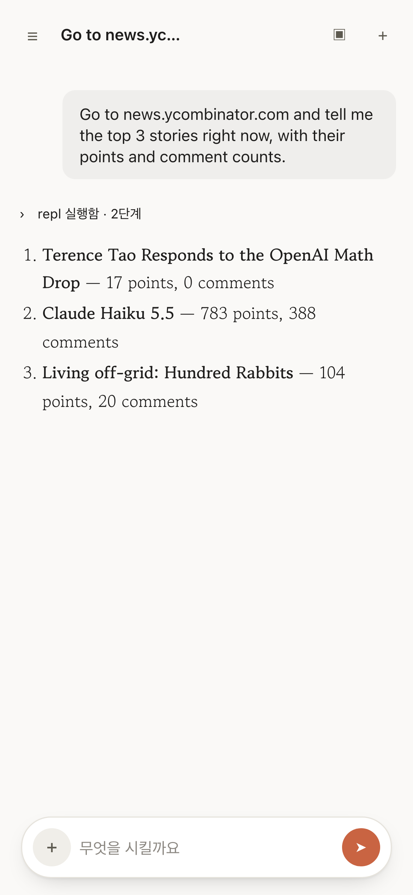
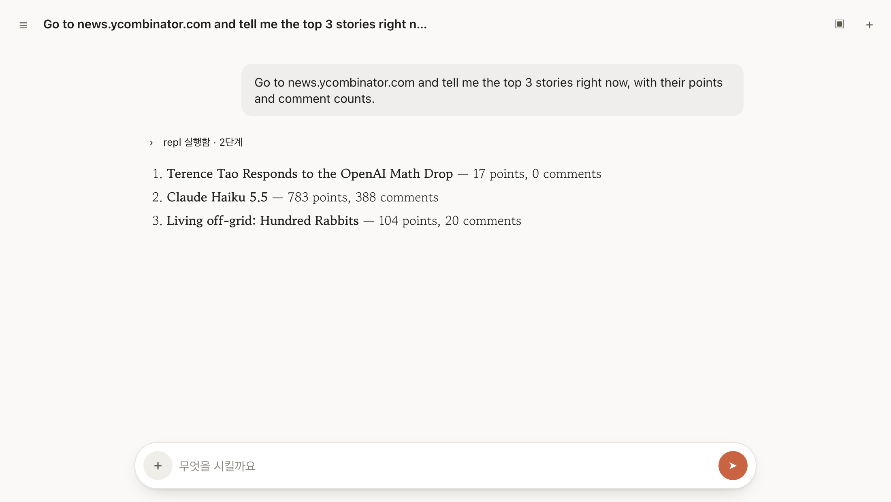

# aside-remote

Use [Aside](https://aside.com) (the agent browser) **from your phone, or any browser** —
a small local bridge that turns your desktop Aside into a chat web app.

<p align="center">
  
  
</p>

```
phone / laptop ──HTTPS/WSS──> (your tunnel + auth) ──> 127.0.0.1:8799  aside-remote
                                                          ├─ aside mcp    persistent process = browser REPL
                                                          ├─ aside exec   PTY = agent runs
                                                          ├─ messages.jsonl tail = live streaming
                                                          └─ aside session list = session status
```

What you get:

- **Chat UI** for your Aside agent — conversation list (search, paging), streaming
  answers with tool-activity folded into pills, image attachments (camera on phones),
  markdown/code rendering, themes (light / dark / Linear dark / your own CSS),
  Korean serif typography.
- **Conversation deletion** — with confirmation; removes the conversation and its local
  session files. Running conversations must be stopped first.
- **Tab browser** — see all open Chrome tabs with live thumbnails, ask the agent to
  work on any tab, and open a live preview that refreshes every 5 s (pause / refresh now).
- **URL routing** — `/c/<session>` deep links, browser back/forward works everywhere.
- Optional **push notification** (ntfy) when a run finishes.

The UI language is currently Korean. PRs welcome.

## Requirements

- macOS with the [Aside](https://aside.com) app installed and signed in
  (the bridge drives Aside's own CLI — it has no AI keys of its own)
- Python ≥ 3.10

## Quick start

```bash
git clone <this repo> && cd aside-remote
pip install -r requirements.txt
python3 scripts/setup.py        # guided; --yes for defaults
python3 server.py               # or let the wizard install a launchd service
```

Open http://127.0.0.1:8799 — on localhost the token is picked up automatically.

## Remote access (phone)

The bridge binds to loopback and **must never be exposed raw**: it can run agents
and execute JavaScript in your browser. Put a real auth layer in front. Two options
that work well:

**Tailscale / VPN** — simplest. `ASIDE_REMOTE_HOST=<tailscale-ip>` (or keep loopback
and use `tailscale serve`), open `http://<mac>:8799`, paste the bearer token from
`~/.aside-remote/token` once in 설정 (Settings).

**Cloudflare Tunnel + Access** — what this repo is built around. Sketch:

1. `cloudflared` tunnel: your domain → `http://127.0.0.1:8799`
2. Cloudflare Zero Trust → Access application for that hostname
   - allow your login email (browser use)
   - add a *service token* if you want a native app shell later
3. Tell the bridge how to verify Access JWTs (wizard step 3, or by hand):

```bash
# ~/.aside-remote/env
ASIDE_REMOTE_ACCESS_TEAM=yourteam.cloudflareaccess.com
ASIDE_REMOTE_ACCESS_AUD=<Access app AUD tag>
ASIDE_REMOTE_ACCESS_EMAILS=you@example.com
```

With that set, a browser that passed the Access login gets the bearer token
automatically (`/api/web-token` verifies the `cf-access-jwt-assertion` signature
against your team's public keys — it does not trust bare headers). No token pasting.

## Manual setup (no wizard)

Everything lives in env vars / an env file — see [`.env.example`](.env.example)
for every key. Minimum viable:

```bash
python3 -c "import secrets;print(secrets.token_urlsafe(32))" > ~/.aside-remote/token
chmod 600 ~/.aside-remote/token
python3 server.py
```

launchd service: render `deploy/com.aside-remote.plist.template`
(`__PYTHON__`, `__REPO__`, `__HOME__`) into `~/Library/LaunchAgents/` and
`launchctl bootstrap gui/$UID <plist>`, or just run `python3 scripts/setup.py --install-service`.

## Security model

```
layer 1   your front door (CF Access / Tailscale / VPN)  — identity
layer 2   bearer token on every API call & WebSocket     — second factor
          (HttpOnly cookie for /WS; never in URLs)
```

- `/api/repl` executes JavaScript in your logged-in browser. Treat the bridge
  like SSH access to your machine.
- File serving is jailed to Aside's session/upload directories (path-escape checked).
- Uploads are sniffed by magic bytes, stored under content hashes.

## How it works — and why it may break

Aside ships no public API. This bridge stands on **reverse-engineered internals**,
verified by measurement (Aside ~1.26.x, 2026-08). The interesting constraints:

```
daemon :21420          write paths are all 401 (install-key challenge signing, key in
                       Keychain → not reimplemented). A few read paths are public:
                       /health /session/recents — but recents is a volatile window,
                       so session listing reads ~/.aside/u/0/sessions from disk instead.
aside exec             prints nothing on a pipe → PTY required. Even then only the
                       final answer; intermediate steps exist only in messages.jsonl.
                       Doesn't print its session id → detected via new-directory diff.
                       After a daemon restart, exec-created sessions can't be continued
                       ("Session not found") — the UI surfaces this.
aside mcp              exposes exactly one tool (repl), but with full browser power.
                       Holding the process keeps REPL scope alive 30 min (measured).
repl sandbox           fs is jailed to "Project and session roots" + the Aside user
                       root (~/.aside/u/0) — that's where uploads go so the agent
                       can actually read them. require()/child_process are blocked.
chrome.* in repl       tabs.query allowed (that's where lastAccessed for tab ordering
                       comes from); tabs.update/reload blocked.
```

An Aside update can invalidate any line above. If something breaks, check these first.

## Themes

Settings → 테마 picks a preset: system (follows the OS light/dark setting), light, dark,
or Linear dark. The choice is stored per browser.

For anything beyond the presets, create `~/.aside-remote/theme.css` on the Mac running the
bridge (path overridable with `ASIDE_REMOTE_THEME_CSS`). It is served at `/theme.css` and
loaded after the built-in styles, so it applies to every device and wins over the presets.
No restart needed — reload the page.

Every color is a CSS variable on `:root`; override those rather than component selectors,
and your theme survives UI updates:

```css
/* ~/.aside-remote/theme.css */
:root { --accent: #2f7d5b; --accent-dim: #2f7d5b; }        /* all presets */
:root[data-theme="dark"] { --bg: #101418; --surface: #161b21; }  /* only the dark preset */
```

`<html data-theme>` always holds the theme actually drawn (`light`, `dark` or `linear`),
never `auto`, so you can target one preset.

```
variable                     role
--bg --surface --surface2    page / cards / hover and chips
--composer                   input box
--text --dim --faint         primary / secondary / muted text
--line --line2               borders (strong / soft)
--accent --accent-dim        buttons, selection, links in tool chips
--bubble                     user message bubble
--err --ok --warn            status colors
--code-bg --code-fg --code-line --code-bar --code-dim     code blocks
--c-comment --c-key --c-str --c-num --c-fn --c-type --c-attr --c-meta   syntax highlight
--sbar --sbar-hi             scrollbar thumb
--font-body --font-ui        body font (also set from Settings) / UI font
```

New presets are welcome as PRs: add a `:root[data-theme="<id>"]` block that sets the
variables above and an entry in `THEMES` in `web/index.html`. Please keep layout changes
out of theme PRs.

## Development

```bash
python3 server.py                      # dev run (uvicorn, port 8799)
node tests/boot.test.mjs               # UI boot smoke test (needs: npm i jsdom)
```

The web UI is a single dependency-free `web/index.html`. Vendored highlight.js is
BSD-3 (see NOTICE).

## License

MIT
